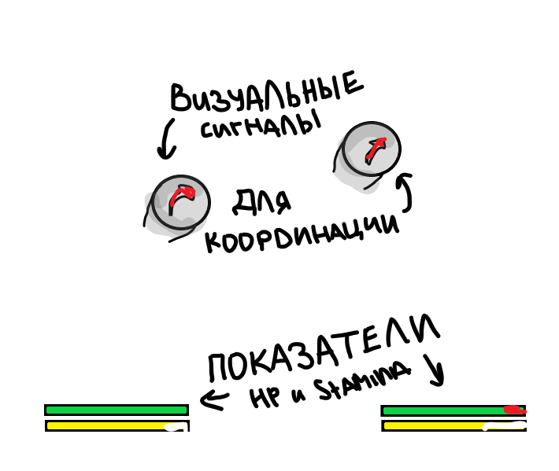

# Техническое задание на разработку игры  
## Рабочее название проекта: *“Horse & Master”*  

### 1. Общая информация

**Жанр:** симулятор  
**Сеттинг:** средневековье  
**Тип игры:** локальный кооператив (2 игрока, один экран)  
**Платформа:** ПК  
**Цель проекта:** создать кооперативный симулятор, в котором игроки управляют человеком с ограниченной подвижностью и его лошадью, действуя совместно для преодоления препятствий и выполнения задач.

### 2. Концепция и описание игрового процесса

Игра представляет собой совместный симулятор передвижения и взаимодействия двух существ — человека и лошади — в условиях средневекового мира.  
Игроки делят управление:  
- **Игрок 1 (Человек)** — отвечает за взаимодействие с предметами, диалоги с NPC, использование инструментов и ориентирование в пространстве. Передвижение ограничено, самостоятельное перемещение возможно только на малые расстояния.  
- **Игрок 2 (Лошадь)** — управляет движением, скоростью, переноской игрока 1, а также выполняет физические действия (перепрыгивание, снос преград, буксировка).

Ключевая механика — **кооперативное движение**: игроки должны синхронно действовать, чтобы перемещаться по миру и выполнять задания. Без взаимопомощи прохождение невозможно.

### 3. Цели и задачи проекта

**Цель:** создать игру, демонстрирующую зависимость и сотрудничество между двумя участниками через несимметричный игровой процесс.  

**Основные задачи:**  
- Реализовать систему совместного управления одним объектом (человек + лошадь) без разделения экрана.  
- Обеспечить визуальные сигналы для координации действий.  
- Создать небольшой, но насыщенный мир с задачами, требующими разных способностей персонажей.  
- Настроить корректное физическое взаимодействие между персонажами.

### 4. Функциональные требования

1. **Совместное управление**  
   Два контроллера/клавиатуры, экран общий. Движение зависит от действий обоих игроков.

2. **Физика персонажей**  
      У лошади:
      масса, ускорение, выносливость;
      у человека:
       ограниченный радиус ходьбы, возможность взаимодействия с объектами.

4. **Взаимодействие**  
   Игрок-человек может садиться на лошадь, привязывать её, кормить; лошадь реагирует на команды и жесты.

5. **Мир**  
   Открытая карта небольшого размера, средневековая деревня, поля, переправы.

6. **Цели миссий**  
   Доставка предметов, помощь NPC, сбор ресурсов, перемещение по труднодоступным локациям.

7. **Кооперативная логика**  
   Некоторые задачи требуют одновременного действия (например, человек открывает ворота, пока лошадь удерживает рычаг).

### 5. Нефункциональные требования

- **Управление:** поддержка клавиатуры и геймпадов.  
- **Интерфейс:** лаконичный, без избыточных элементов HUD. Единый экран с динамическими подсказками в зависимости от роли игрока. Раздельльные индикаторы здоровья, усталости.
- **Звук:** акцент на шаги, дыхание, реакции лошади, атмосферные эффекты (ветер, кузница, звон колокола).  
- **Оптимизация:** размер сборки не более 1.5 ГБ.

---

### 6. Техническая реализация

- **Движок:** Unity или Unreal Engine (система Split Input для двух игроков).  
- **Физика:** базируется на встроенной системе Rigidbody (Unity) / Chaos Physics (UE).  
- **Синхронизация действий:** система событий с задержкой не более 100 мс для одновременных действий.  
- **Сохранения:** автоматические контрольные точки.  

**Пример задачи:**  
Игроки должны перевезти тяжёлый груз через реку.  
- Лошадь удерживает повозку и двигается по течению.  
- Человек управляет балансом груза и регулирует натяжение поводьев.  
Только согласованные действия позволяют не уронить груз.

---

### 7. Критерии готовности

- Все механики двух игроков работают синхронно.  
- Отсутствуют коллизии или визуальные артефакты.  
- Минимальный игровой цикл (1–2 миссии) завершён и играбелен.  
- Игра воспринимается как целостный симулятор взаимодействия.

---

### 8. Дополнительные материалы

| Элемент | Описание |
|----------|-----------|
| Таблица управления | Отдельные кнопки для взаимодействий человека и лошади. |
| Эскизы интерфейса | Минимальные подсказки: иконки действий, индикатор выносливости лошади. |
| Сценарий демонстрации | Короткая миссия: доставить груз из деревни в замок, минуя мост. |

**Схема взаимодействия ролей:**

   [Человек] → подаёт команду → [Лошадь]
   [Лошадь] → выполняет действие → [Изменение в мире]
   [Мир] → открывает новые возможности → [Человек]

